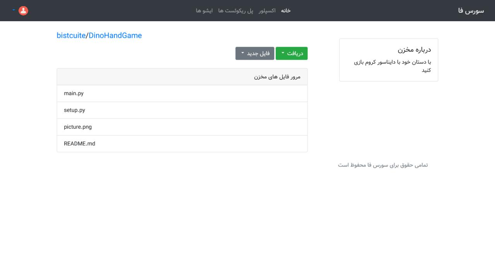
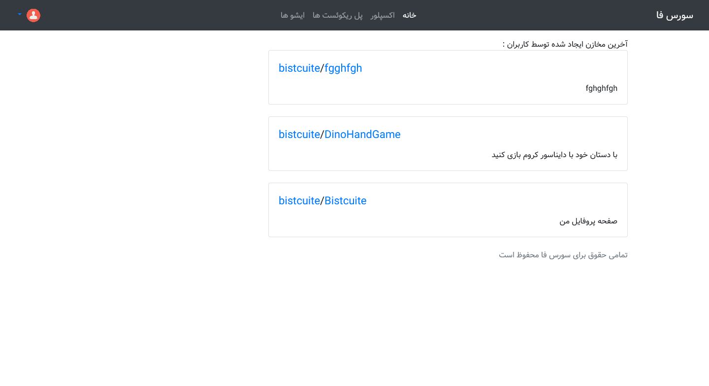
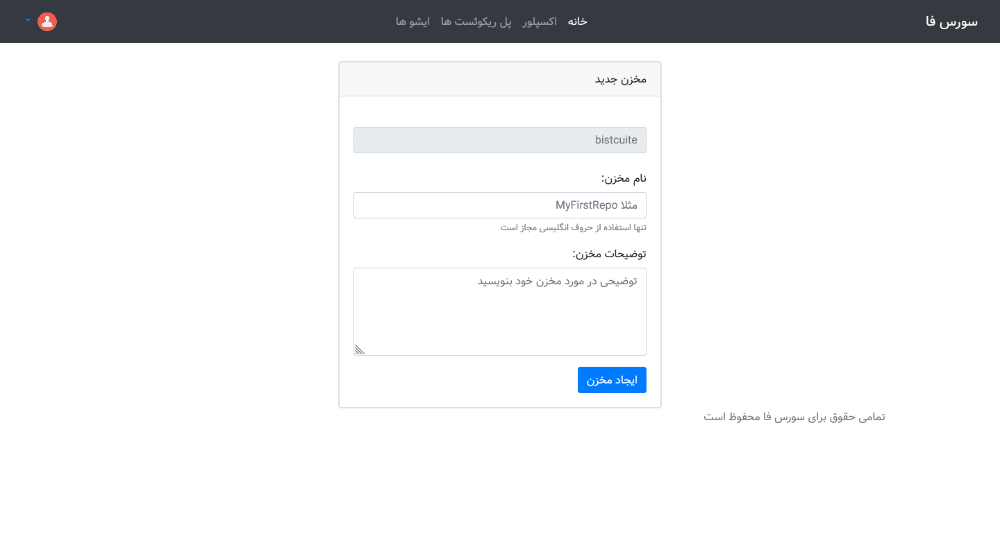
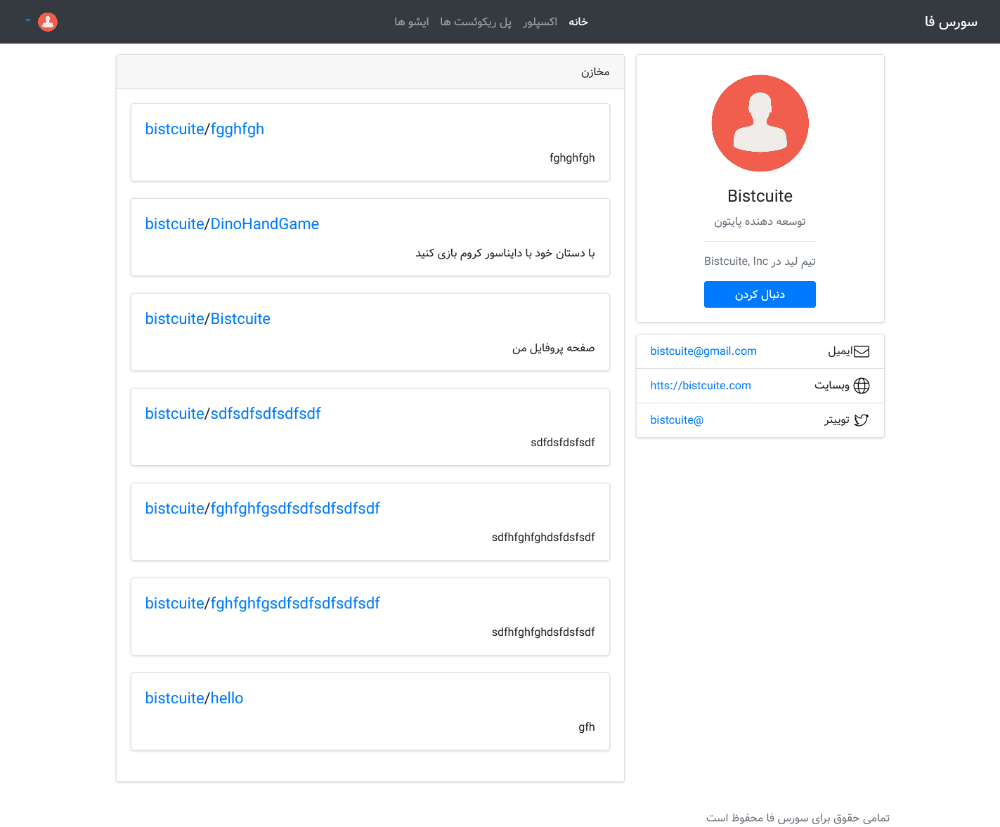
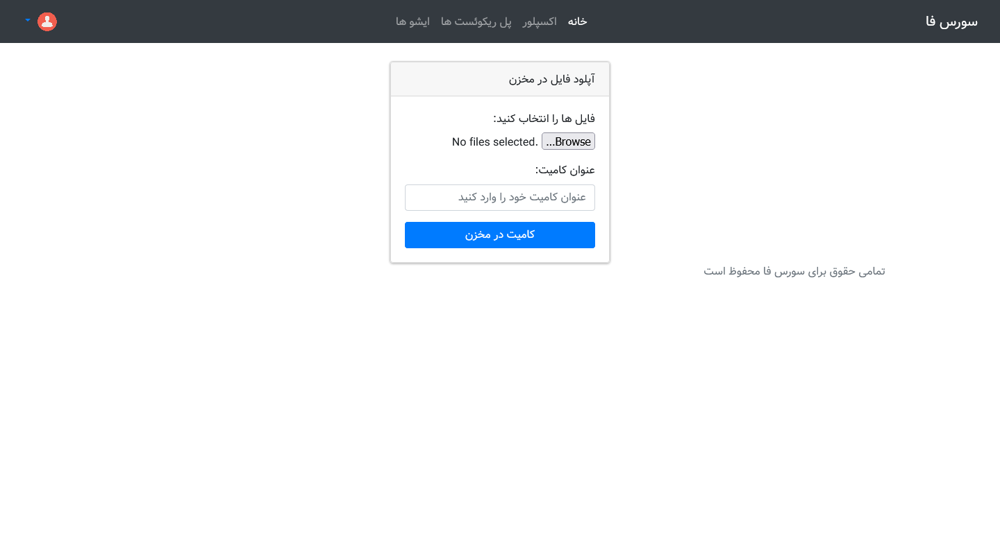
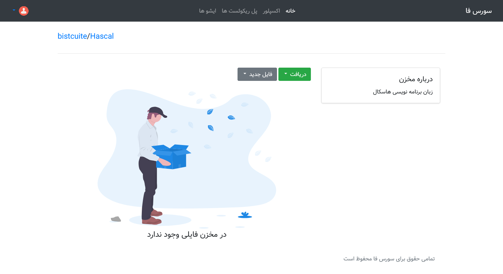

# SourceFa
**SourceFa** is an open-source persian reposirory management system written in django.

Start project: 2021-10-1
## Features
- [x] Public Repos
- [x] Markdown Based Readme
- [x] Commit to repo 
- [x] Profile Page
- [x] Download Zip File of repo
- [ ] Private Repos
- [ ] Explore Repo Files **[WIP]**
- [ ] Fork & Pull Request
- [ ] Issues
- [ ] Admin Page
- [ ] Explorer
- [ ] RESTful API
- [ ] Based On Git Version Control System
- [ ] QT Based Desktop Client
- [ ] Branching

## Get Started
- Clone SourceFa's Source:
```
git clone https://github.com/SourceFa/SourceFa.git
```
- Go to SourceFa folder :
```
$ cd SourceFa
```
- Configure Project :
```
$ pip install -r requirments.txt
$ python manage.py makemigrations
$ python manage.py migrate
$ python manage.py createsuperuser
Username:
Email Address:
Password:
Password (again):
$ python manage.py runserver
```

## Screenshots








## License
This project license under the **GPL-V3** License, read the [License](LICENSE).

## About
Copyright 2021 &copy; **SourceFa Team**, \
all rights reserved.
